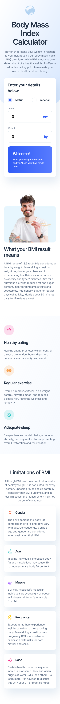
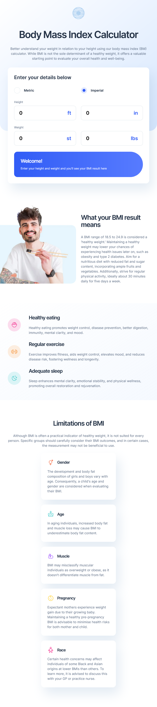
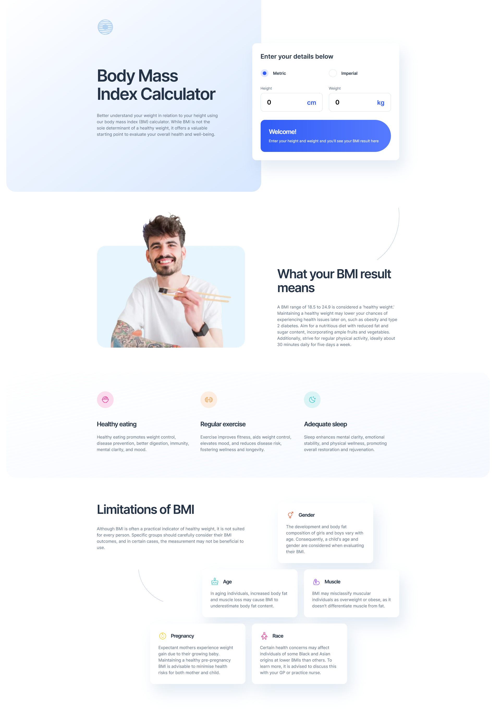

# Frontend Mentor - Body Mass Index Calculator solution

This is a solution to the [Body Mass Index Calculator challenge on Frontend Mentor](https://www.frontendmentor.io/challenges/body-mass-index-calculator-brrBkfSz1T). Frontend Mentor challenges help you improve your coding skills by building realistic projects.

## Overview

### The challenge

Users should be able to:

- Select whether they want to use metric or imperial units
- Enter their height and weight
- See their BMI result, with their weight classification and healthy weight range
- View the optimal layout for the interface depending on their device's screen size
- See hover and focus states for all interactive elements on the page

## Links

- Solution URL: [Solution page](https://www.frontendmentor.io/solutions/bmi-calculator-with-svelte-F8l92k7plP)
- Live Site URL: [GitHub Pages Site](https://karolbanat.github.io/fem-svelte-bmi-calculator/)

## Built with

- Semantic HTML5 markup
- CSS custom properties
- Flexbox
- CSS Grid
- Mobile-first workflow
- [Vite](https://vitejs.dev/)
- [Svelte](https://svelte.dev/)

## Useful resources

- [New approach to container and wrapper classes](https://www.youtube.com/watch?v=c13gpBrnGEw) - New approach to wrappers explained in Kevin Powell's video

## Screenshots

## Author

- Frontend Mentor - [@karolbanat](https://www.frontendmentor.io/profile/karolbanat)
